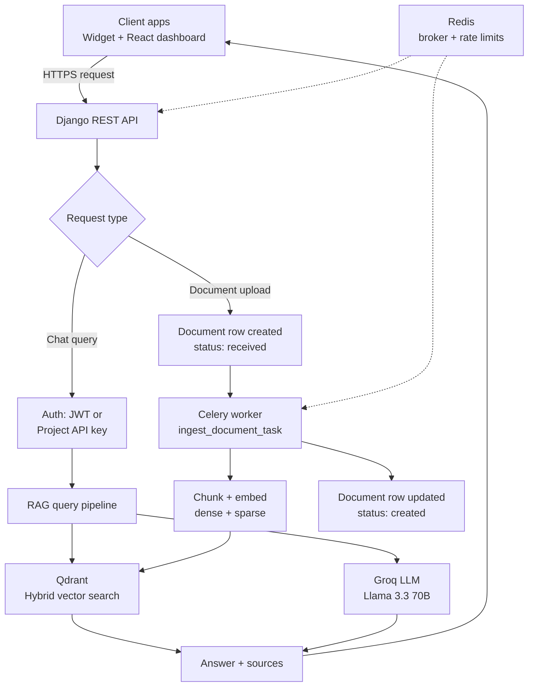
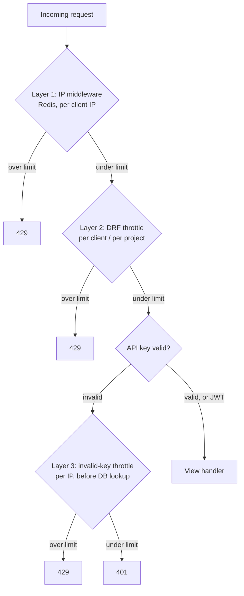

<p align="center">
  
</p>

# AthenaChat

**RAG-powered chatbot-as-a-service.** Businesses upload their documents, paste one script tag, and get an AI chatbot on their site that answers only from their own content.

> 🚧 Actively developed, pre-launch. Live demo link coming soon after deployment.

---

## What it does

1. A business signs up and creates a project (one project per domain/site)
2. They upload their documents — FAQs, product docs, service details
3. AthenaChat chunks, embeds, and indexes them in a multi-tenant vector store
4. They paste one `<script>` tag on their site
5. Visitors chat with a bot that answers strictly from that business's own documents

---

## Architecture



Every chat/document request is also gated by a three-layer rate-limiting stack before it reaches application code:



---

## Key design decisions

- **Hybrid retrieval** — dense embeddings (Jina) + SPLADE sparse vectors, fused with Reciprocal Rank Fusion, so search understands both meaning and exact keyword matches
- **Multi-tenant isolation, verified not assumed** — every vector, document, and query is scoped by `client_id` *and* `project_id`; a leaked widget API key can only ever reach one project's documents, not a client's whole account
- **Async by default** — document ingestion and cleanup run on Celery workers with an explicit status state machine (`received → processing → created/failed`), designed to survive crashed tasks without orphaning data or vectors
- **API keys designed for public exposure** — a project's widget key lives in a public `<script>` tag by necessity. Security comes from domain validation, layered rate limiting, and fast revocation/rotation — not secrecy
- **Soft-delete everywhere destructive** — documents and projects are marked `deleting`/`deleted` before any external cleanup runs, so a crashed background task leaves a durable, inspectable trail instead of silent data loss

---

## Tech stack

| Layer | Technology |
|---|---|
| Backend API | Django + Django REST Framework |
| Auth | `djangorestframework-simplejwt` (JWT) + per-project API keys |
| Async tasks | Celery + Redis (broker, rate limiting, result backend) |
| Scheduling | `django-celery-beat` (DB-backed periodic tasks) |
| Vector DB | Qdrant (hybrid dense + sparse search, multi-tenant payload filtering) |
| Dense embeddings | `jina-embeddings-v5-text-nano` |
| Sparse embeddings | FastEmbed SPLADE |
| LLM inference | Groq API (Llama 3.3 70B) |
| Dashboard | React (Vite, plain JS) + `react-colorful` + GSAP |
| Embeddable widget | Vanilla JS, Shadow DOM–isolated, no build step |
| Relational DB | PostgreSQL |

---

## Project structure

```
chatbot-saas/
├── backend/                 # Django project
│   ├── config/               # Settings, urls, celery app
│   ├── core/                 # Client auth, Project model, API keys, middleware
│   ├── chatbot/               # Chat endpoint, RAG wiring
│   └── documents/             # Upload, Celery ingestion tasks, deletion sweep
├── dashboard/                # React dashboard (Vite)
│   └── src/
├── widget/                   # Embeddable chat widget (vanilla JS)
│   ├── widget.js
│   └── widget.css
├── rag/                      # Standalone RAG pipeline (Django-agnostic, reusable)
│   ├── ingest.py
│   ├── query.py
│   ├── config.py
│   └── utils/
├── docs/
└── requirements.txt
```

`rag/` is deliberately decoupled from Django — it's importable as a standalone package by any other project.

---

## Getting started

**Prerequisites:** Python 3.11+, Node 20+, Docker (for Qdrant + Redis), PostgreSQL, a Groq API key.

```bash
# clone
git clone https://github.com/arjun16-t/chatbot-saas.git
cd chatbot-saas

# backend
python -m venv venv && source venv/bin/activate
pip install -r requirements.txt
cp .env.example .env   # fill in DB, Redis, Qdrant, and Groq credentials

# start Qdrant + Redis
docker run -p 6333:6333 qdrant/qdrant
docker run -p 6379:6379 redis

cd backend
python manage.py migrate
python manage.py runserver

# in a separate terminal — Celery worker
celery -A config worker --loglevel=info --concurrency=1

# in a separate terminal — Celery beat (scheduled cleanup tasks)
celery -A config beat --loglevel=info

# frontend
cd ../dashboard
npm install
npm run dev
```

> Update `.env.example` with your own variable names before publishing — this section assumes standard Django/Celery/Qdrant env conventions.

---

## Status & roadmap

| Done | In progress / planned |
|---|---|
| Multi-tenant RAG pipeline, hybrid search | Bring-your-own-Groq-key for free tier |
| Full auth: JWT + per-project API keys | Production deployment (Railway/Render) |
| Async document ingestion + cleanup | Subscription plans & usage metering |
| Embeddable widget with Shadow DOM isolation | API documentation pass |
| Dashboard: projects, documents, live theme preview | Switch embedding model to an Apache 2.0 license before commercial launch |
| Three-layer rate limiting | File encryption at rest (on S3 migration) |

---


## License
<a href="LICENSE">Apache License 2.0