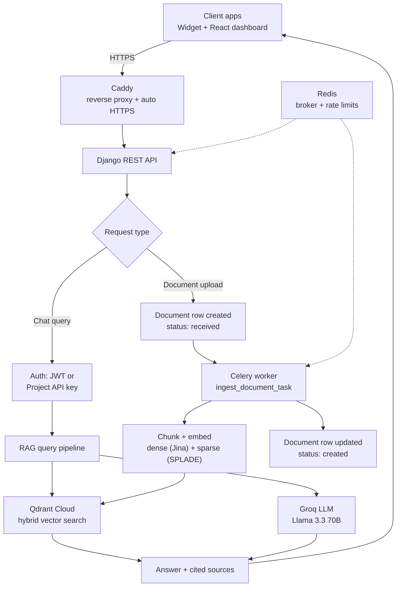
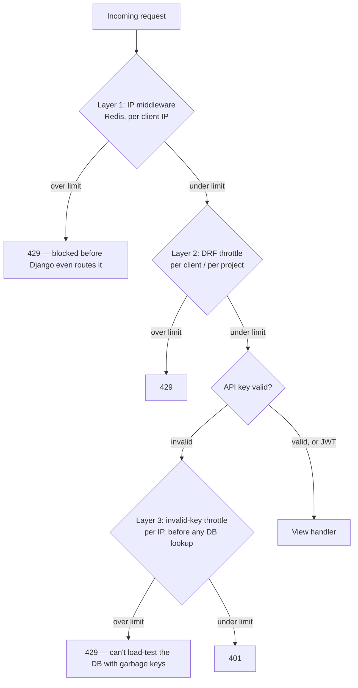

<p align="center">
  
</p>

<h1 align="center">AthenaChat</h1>

<p align="center">
  <b>RAG-powered chatbot-as-a-service.</b><br/>
  Upload your docs, paste one script tag, and let your website stop saying<br/>
  "please check our FAQ page" and start actually answering the question.
</p>

<p align="center">
  🟢 <b>Live in production</b> — <a href="https://athenachat.arjunt.online">Dashboard</a> · <a href="https://ac-api.arjunt.online/api/docs/">API Docs (Swagger Docs)</a><br/>
  <sub>Solo-built, end-to-end: architecture → backend → frontend → widget → Docker → GCP deployment</sub>
</p>

---

### The elevator pitch

Most "AI chatbots" bolted onto a website are really just a wrapper around an LLM that will confidently make things up the moment a user asks something outside the FAQ page. AthenaChat doesn't hallucinate a support policy — it retrieves the actual document chunk that supports the answer, and cites it. If your docs don't say it, the bot doesn't either. Zero-shot lying is not a feature.

---

## 🧠 What it does

1. A business signs up and creates a **project** (one project per domain/site)
2. They upload their documents — FAQs, product docs, service details
3. AthenaChat chunks, embeds, and indexes them into an isolated slice of a multi-tenant vector store
4. They paste **one `<script>` tag** on their site
5. Visitors chat with a bot that answers strictly from *that business's own documents* — nothing else, no leakage across tenants, no made-up answers

---

## 🏗️ Architecture



Every request also runs a gauntlet before it's allowed anywhere near an LLM or a database — three layers deep, because rate limiting after the damage is done isn't rate limiting:



---

## 🎯 Key design decisions

- **Hybrid retrieval** — dense embeddings + SPLADE sparse vectors, fused with Reciprocal Rank Fusion, so search understands both *meaning* and *exact keyword* matches. Semantic search alone misses SKU numbers; keyword search alone misses paraphrasing. Hybrid does both.
- **Multi-tenant isolation, verified not assumed** — every vector, document, and query is scoped by `client_id` *and* `project_id`. A leaked widget API key can only ever reach one project's documents, never a client's whole account. Actually tested with two clients trying to read each other's data, not just designed and hoped for.
- **Async by default** — document ingestion and cleanup run on Celery workers with an explicit status state machine (`received → processing → created/failed`), built to survive a crashed worker mid-task without orphaning vectors or files.
- **API keys designed for public exposure** — a project's widget key lives in a public `<script>` tag by necessity, so it's treated as public from day one. Security comes from domain validation, layered rate limiting, and instant rotation/revocation — not from pretending the key is secret.
- **Soft-delete everywhere destructive** — documents and projects flip to `deleting` before any external cleanup runs, so a crashed background task leaves a durable, inspectable trail instead of silently vanishing data.
- **BYOK for LLM calls** — clients supply their own Groq API key (Fernet-encrypted at rest, decrypted just-in-time per request, never cached across tenants). No shared-key metering headache, no accidental cross-client key reuse.

---

## 🧬 On the embeddings

AthenaChat's dense retrieval runs on `jina-embeddings-v5-text-nano` — small, fast, and genuinely good at its MTEB weight class. The catch: it's licensed **CC BY-NC 4.0** (non-commercial). Since this is a solo-built portfolio project and not a commercial product, that's a perfectly honest fit — and it's flagged here explicitly rather than swept under the rug. A production/commercial fork would swap this for an Apache 2.0-licensed model (e.g. `bge-small-en-v1.5`) before charging anyone a rupee for it.

---

## 🛠️ Tech stack

| Layer | Technology |
|---|---|
| Backend API | Django + Django REST Framework |
| Auth | `simplejwt` (JWT) + per-project API keys (SHA256-hashed) |
| Async tasks | Celery + Redis (broker, rate limiting) |
| Scheduling | `django-celery-beat` (DB-backed periodic tasks) |
| Vector DB | Qdrant Cloud (hybrid dense + sparse search, multi-tenant payload filtering) |
| Dense embeddings | `jina-embeddings-v5-text-nano` *(CC BY-NC — see above)* |
| Sparse embeddings | FastEmbed SPLADE |
| LLM inference | Groq API (Llama 3.3 70B) — bring-your-own-key |
| Dashboard | React (Vite, plain JS) + `react-colorful` + GSAP |
| Embeddable widget | Vanilla JS, Shadow DOM–isolated, zero build step |
| Relational DB | PostgreSQL |
| Deployment | Docker Compose on GCP (`e2-medium`) + Caddy (auto HTTPS) + Vercel (frontend) |
| Dependency management | `uv` |

---

## 📁 Project structure

```
chatbot-saas/
├── backend/                  # Django project
│   ├── config/                 # Settings, urls, celery app
│   ├── core/                   # Client auth, Project model, API keys, middleware
│   ├── chatbot/                 # Chat endpoint, RAG wiring
│   └── documents/               # Upload, Celery ingestion tasks, deletion sweep
├── dashboard/                 # React dashboard (Vite)
│   └── src/
├── widget/                    # Embeddable chat widget (vanilla JS)
│   ├── widget.js
│   └── widget.css
├── rag/                       # Standalone RAG pipeline (Django-agnostic, reusable)
│   ├── ingest.py
│   ├── query.py
│   ├── config.py
│   └── utils/
├── compose.yaml                # Base/prod Docker Compose
├── compose.override.yaml       # Dev-only overrides
├── Dockerfile                   # Multi-stage build
├── Caddyfile
├── docs/
└── pyproject.toml
```

`rag/` is deliberately decoupled from Django — importable as a standalone package by any other project. It doesn't know Django exists, and it doesn't want to.

---

## 🚀 Running it locally

**Prerequisites:** Python 3.11+, Node 20+, Docker, PostgreSQL, a Groq API key (get one free at [console.groq.com](https://console.groq.com/keys)).

### Option A — Docker Compose (closest to production)

```bash
git clone https://github.com/arjun16-t/chatbot-saas.git
cd chatbot-saas
cp .env.example .env   # fill in DB, Redis, Qdrant, Groq credentials

docker compose up -d           # spins up db, redis, backend, celery, celery-beat, caddy
docker compose logs -f backend # watch it come alive
```

### Option B — Manual (for poking around / active development)

```bash
git clone https://github.com/arjun16-t/chatbot-saas.git
cd chatbot-saas

# backend
uv venv && source .venv/bin/activate
uv sync
cp .env.example .env

# infra
docker run -p 6333:6333 qdrant/qdrant
docker run -p 6379:6379 redis

cd backend
python manage.py migrate
python manage.py runserver

# separate terminal — Celery worker (concurrency=1 is load-bearing, not optional)
celery -A config worker --loglevel=info --concurrency=1

# separate terminal — Celery beat
celery -A config beat --loglevel=info

# frontend
cd ../dashboard
npm install
npm run dev
```

> Update `.env.example` with your own secrets before publishing anything — don't reuse dev secrets in prod. Ask me how I know.

---

## 📊 Status & roadmap

| ✅ Done | 🔜 In progress / planned |
|---|---|
| Multi-tenant RAG pipeline, hybrid search | Subscription plans & usage metering |
| Full auth: JWT + per-project API keys | API documentation pass (`drf-spectacular`) |
| Async document ingestion + cleanup, Celery/Redis | Switch embedding model to Apache 2.0 (before any commercial use) |
| Embeddable widget, Shadow DOM–isolated | File encryption at rest (on S3 migration) |
| Dashboard: projects, documents, live theme preview | AsyncGroq + ASGI (deliberately deferred, not forgotten) |
| Three-layer rate limiting | |
| BYOK Groq keys (Fernet-encrypted) | |
| **Production deployment** — Docker, GCP, Caddy, Vercel, real HTTPS domains | |

---

## 📜 License

<a href="LICENSE">Apache License 2.0</a> — applies to this codebase. Note the embedding model dependency noted above carries its own, separate CC BY-NC license.